19.03.2019
Stworzenie bazy danych sql
26.03.2019
Wygenerowanie projektu,
zmapowanie danych z bazy danych na objekty,
poprawienie autentykacji
02.04.2019
Umo�liwienie dodawania i edytowania danych wszystkich relacji
Stworzenia zak�adki z wydarzeniami 
(Admin mo�e wykonywa� wszystkie operacje, a user tylko przegl�da�)

09.04.2019
Dodanie nowego modeli do pobierania wybranych danych z bazy,
Dodanie wyszukiwania po nazwie wydarzenia, miejscowości oraz po kategorii
Dodanie do relacji Event kolumn image oraz price.

07.05.2019
Koszyk, dodawanie do koszyka biletu,
Podsumowanie zamówienia,
Testy do zamówień i biletów

14.05.2019
Wysyłanie biletu na email
Poprawa płatności, nie ma możliwości oszukania systemu
Płatności paypal (sandbox)

21.05.2019
Zakładka klienta z zamówieniami, historia zamówionych biletów.
Opis API, screenshoty jak wygląda API.
Screeny aplikacji.

APPLICATION SCREENS:

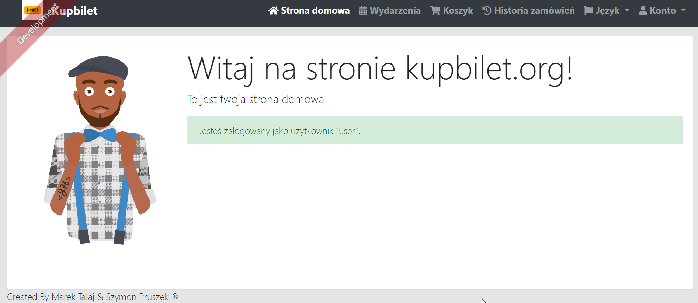

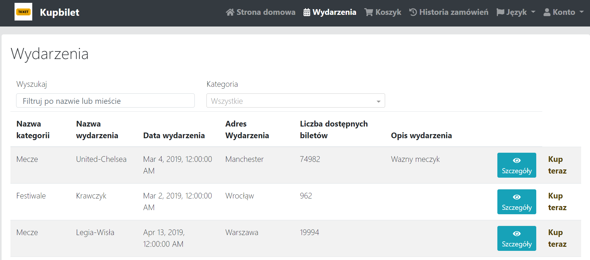

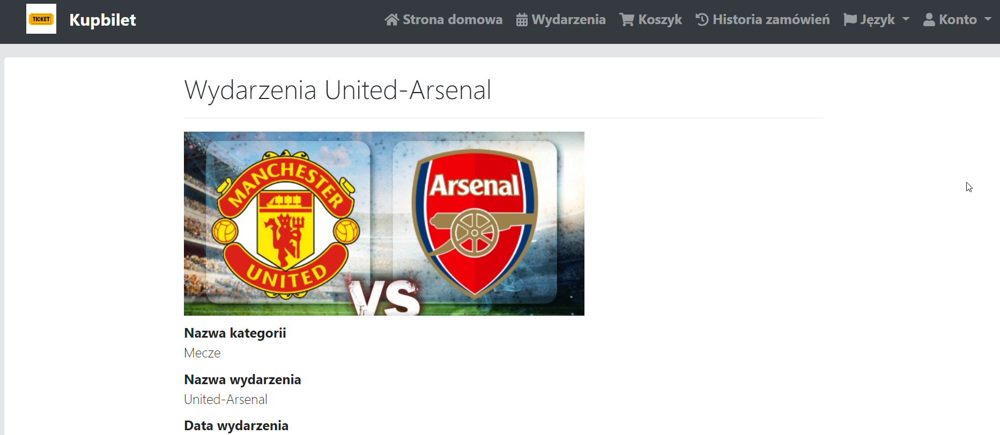

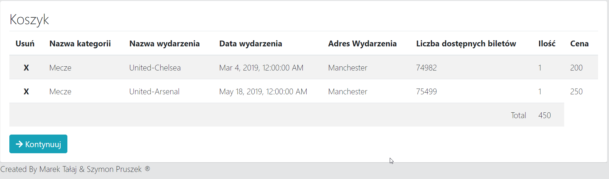

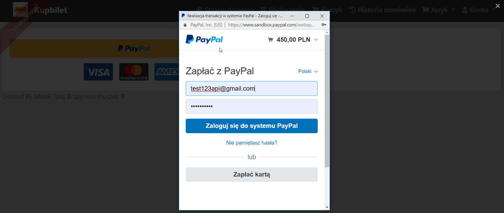

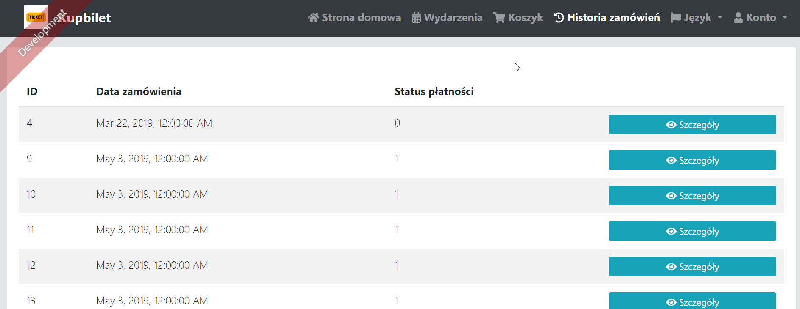

APPLICATION API:

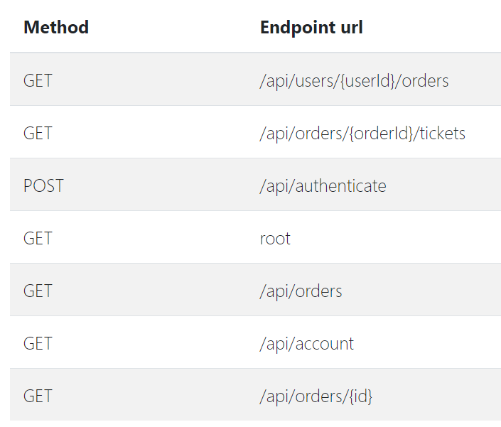

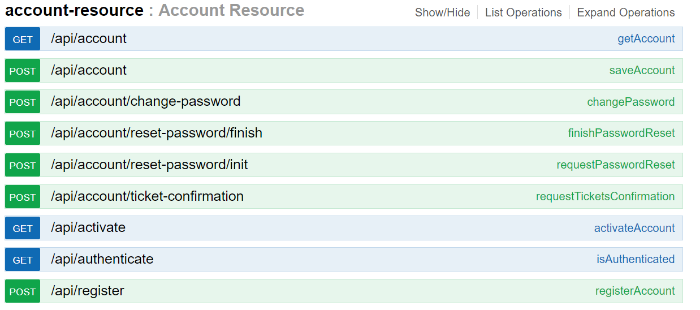

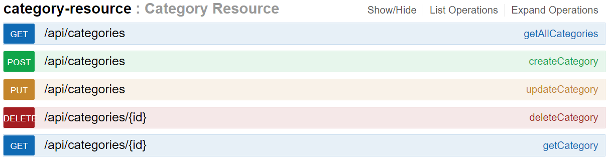

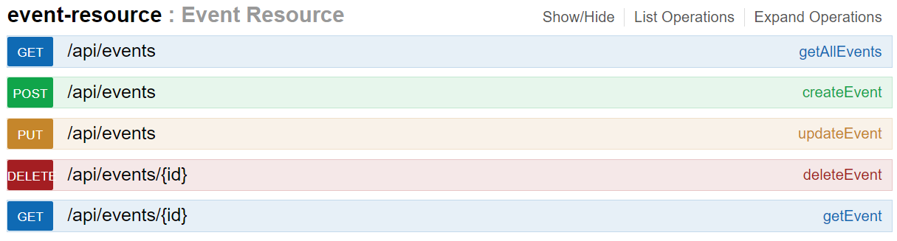

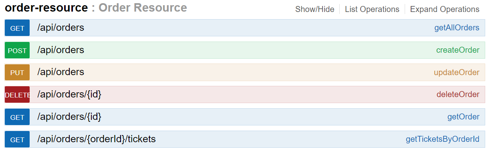

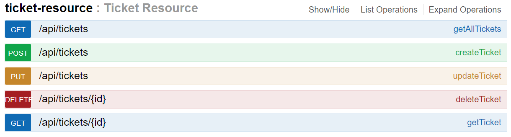

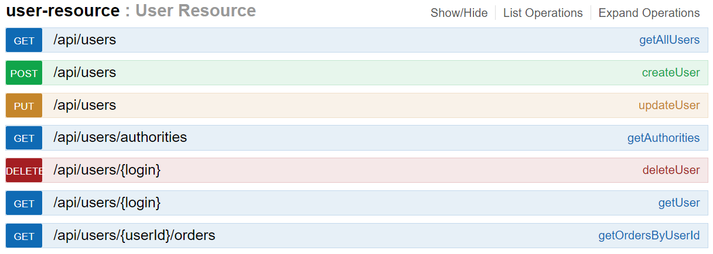

